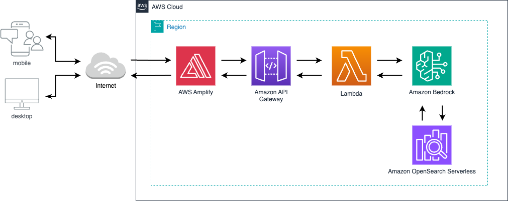

# AI Chat Web App with Bedrock RAG

A simple web application that provides Generative AI chat functionality using Amazon Bedrock with Retrieval-Augmented Generation (RAG) capabilities through Bedrock Knowledge Base.

## Overview

This project implements a conversational AI interface that can retrieve information from a knowledge base to provide more accurate and contextual responses. The application consists of:

- **Frontend**: Web interface hosted on AWS Amplify using ReactJS
- **Backend**: API Gateway and Lambda function (Python)
- **AI Services**: Amazon Bedrock for FM access and Knowledge Base for RAG capabilities
- **Vector Database**: Amazon OpenSearch Serverless
- **Data Source**: Amazon S3 for data source storage

## Architecture Diagram



## Project Structure

```
claude-chat-app/
├── amplify/                                    # AWS Amplify configuration and backend code
│   └── backend/
│       └── function/                           # Lambda function code
│           └──bedrockRagFunction/src/index.py  # Edit the knowledge base ID in this file
├── prerequisites/
│   ├── data/                                   # Local data source file for knowledge base   
│   ├── create_bedrock_kb.py                    # Script to create Bedrock Knowledge Base
│   ├── requirements.txt                        # Python modules needed
│   └── README.md                               # Instructions for the prerequisites
├── src/
│   ├── App.js                                  # Main application component
│   ├── App.css                                 # Application styles
│   └── index.js                                # Application entry point
├── package.json                                # NPM dependencies
└── README.md                                   # Project documentation (this README file)
```

## Getting Started

### Clone the Repository

```bash
# Clone this repository
git clone https://github.com/MardiantoS/chat-ai-bedrock-rag.git

# Navigate to the project directory
cd chat-ai-bedrock-rag
```

## Prerequisites

- AWS Account with appropriate permissions
- AWS CLI configured with access and secret keys
- AWS Amplify package
- Python 3.9 or higher
- Node.js and npm (for the frontend)

## Setup Instructions

### 1. Knowledge Base Setup

Before deploying the main application, you need to set up the Knowledge Base:

1. Navigate to the `prerequisites` directory
2. Follow the README instructions within the directory
3. Note the Knowledge Base ID that is generated from the script
4. Edit `amplify/backend/function/bedrockRagFunction/src/index.py` and update the Knowledge Based ID placeholder with the one generated in the previous step 

### 2. Install all Node packages

1. Install Amplify CLI if you haven't already
```bash
npm install -g @aws-amplify/cli
``` 

2. Install dependency packages:
```
npm install
```

### 3. Setup the backend: API Gateway and Lambda

1. Deploy the backend services:
```bash
amplify push
```

### 4. Run test locally (optional, but recommended)

1. Run the app in the development mode.
```bash
npm start
```

2. Open [http://localhost:3000](http://localhost:3000) to view it in your browser.


### 5. Frontend Deployment with AWS Amplify
Once your local test is successful, you can deploy the frontend.
If you're running it for the first, run 

 - Add hosting to your Amplify project:
   ```bash
   amplify add hosting
   ```

 - Choose your hosting options:
   ```
   ? Select the plugin module to execute: Hosting with Amplify Console
   ? Choose a type: Manual deployment
   ```

 - Deploy your application:
   ```bash
   amplify publish
   ```

## Usage

1. Navigate to the deployed Amplify URL in your web browser
2. Start a conversation in the chat interface
3. You can ask questions about JPMorgan Cahse shareholder and financial highlight reports for 2023 and 2024, and the application will use Retrieval-Augmented Generation (RAG) capability from the Amazon Bedrock Knowledge Base to provide more accurate and contextual responses

### Sample Questions
Here are some example questions you can ask:

- "What was net income per share in 2022, 2023, and 2024?"
- "What are the significant challenges in 2024?"
- "When did Jamie Dimon start as CEO of BankOne?"

## License

This project is licensed under the MIT License - see the [LICENSE](LICENSE) file for details.

## Citations

If you use this code in your projects or research, please include the following citation:

> Mardianto Hadiputro. (2025). AI Chat Application with Amazon Bedrock RAG. GitHub. https://github.com/MardiantoS/chat-ai-bedrock-rag

## Acknowledgments

- The prerequisite script is based on the RAG examples from [Amazon Bedrock Workshop | Knowledge Bases and RAG](https://github.com/aws-samples/amazon-bedrock-workshop/tree/75aa73f60903f85bd0c7abc84fa6ff85c0789105/02_Knowledge_Bases_and_RAG)
